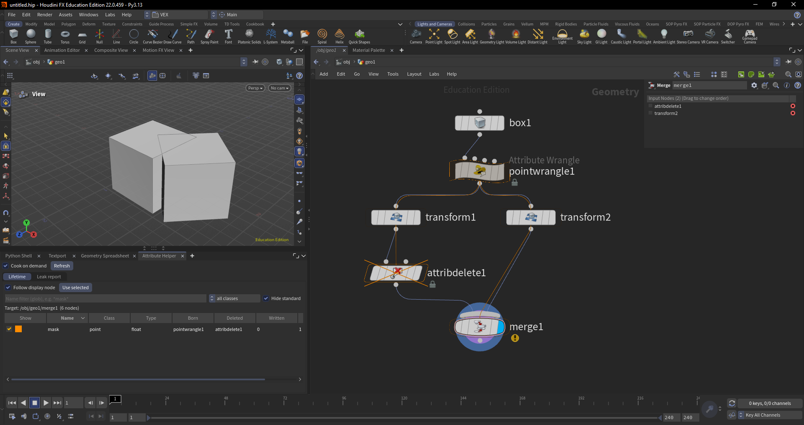
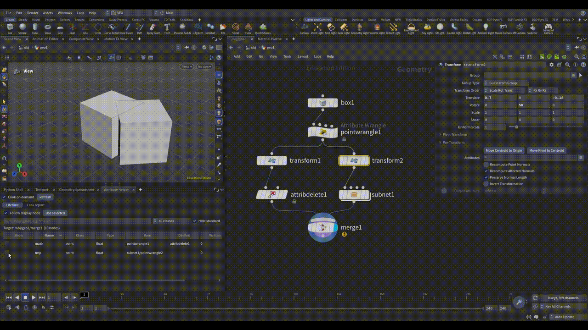
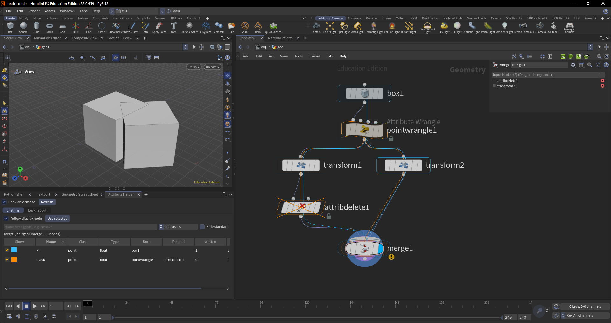
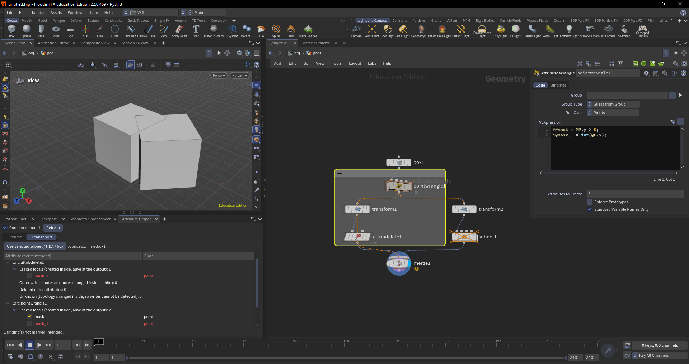
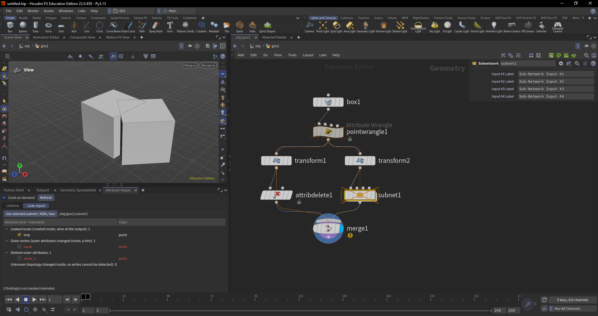

# attribute-helper

[English](README.md) | [日本語](README.ja.md) | **繁體中文**

這是一個 Houdini 22 的 Python Panel。它會在網路編輯器（Network Editor）上以疊加圖層顯示每個 SOP
屬性在哪裡誕生（Born）、被寫入（Written）、原樣通過（Pass-through）以及被刪除（Deleted）。
它也會列出子網路（subnet）、HDA 或網路框（Network Box）洩漏到外部的屬性，並讓你把每一項標記為
「預期中」。

在 Houdini 中，節點建立的屬性會隨著幾何一路往下游傳。網路一旦變大，就很難追蹤每個屬性從哪裡來、
往哪裡去。這個面板把這件事視覺化，讓你輕鬆找出從子網路漏出去的暫存屬性，或是被覆寫掉的外部屬性。

狀態：pre-alpha。[docs/plan.md](docs/plan.md) 的六個階段已全部完成。僅支援 Houdini 22。



> 介面文字為英文（與 Houdini 介面一致），本文件中的按鈕名稱等保留英文原文。

## 安裝

1. 把這個儲存庫放到電腦上任何位置（clone 或下載）。
2. 在 Houdini 中開啟 **Windows** > **Python Shell**，執行下面這一行。把
   `<path-to-attribute-helper>` 換成你放置儲存庫的資料夾，路徑請用正斜線 `/`
   （例如 `D:/tools/attribute-helper`）：

   ```python
   import runpy; runpy.run_path(r"<path-to-attribute-helper>/install.py")
   ```

   它會印出安裝位置。它只會寫入一個小檔案
   `<Houdini 偏好設定資料夾>/packages/attribute_helper.json`，用來告訴 Houdini 這個資料夾在哪裡。
3. 重新啟動 Houdini。
4. 開啟面板：在任一窗格點 **+** > **New Pane Tab Type** > **Inspectors** >
   **Attribute Helper**。建議放在網路編輯器旁邊。

如果搬移了儲存庫，請在新位置重新執行一次安裝指令。

<details>
<summary>改為手動安裝</summary>

在 Houdini 偏好設定資料夾（`$HOUDINI_USER_PREF_DIR`：Windows 通常是 `Documents/houdini22.0`，
Linux 是 `~/houdini22.0`，macOS 是 `~/Library/Preferences/houdini/22.0`）的 `packages`
資料夾中建立 `attribute_helper.json`。`<path-to-attribute-helper>` 的替換方式同上：

```json
{"package_path": "<path-to-attribute-helper>/package"}
```

在 Windows 上，從開始選單啟動的 Houdini 會讀取 `Documents/houdini22.0`，但若從設定了 `HOME`
的 shell（例如 Git Bash）啟動，則會改讀 `$HOME/houdini22.0`。安裝腳本會直接詢問正在執行的
Houdini 它的偏好設定位置，因此不會遇到這個問題。

</details>

## 快速上手

1. 進入一個有幾個節點、並設好顯示旗標（display flag）的 SOP 網路。
2. **Lifetime** 分頁會列出顯示節點上游整條鏈中的所有屬性。
3. 勾選一個屬性，它的生命週期就會畫在網路編輯器上。
4. 要檢查子網路，請選取它，開啟 **Leak report** 分頁，然後點
   **Use selected subnet / HDA / box**。

## Lifetime 分頁

### 目標節點

面板會以一個**目標**節點為對象，涵蓋同一網路中它上游的所有節點。

- **Follow display node**（預設）：目標是編輯器目前顯示的網路中的顯示節點。進出網路或移動顯示旗標時
  會自動跟隨。
- **Use selected**：把目前選取的 SOP 固定為目標。再次勾選 **Follow display node** 即可取消固定。

篩選列下方那一行會顯示目標節點與讀取的節點數量。

### Cook on demand

讀取節點的幾何資料可能會觸發 cook（計算），在大型場景中可能很慢。

- **關閉**（預設）：只讀取已經 cook 過的節點。需要 cook 的節點會被略過，狀態列會顯示數量。若要納入
  它們，請把該節點設為顯示，或開啟此選項。
- **開啟**：需要時會 cook 節點。

**Refresh** 會清除面板的快取並重新讀取全部。通常不需要：面板顯示時每秒檢查四次變更，且只重新讀取
重新 cook 過的節點。

### 表格

鏈中的每個屬性（以及每個群組）各佔一列：

| 欄位 | 說明 |
|---|---|
| Show | 勾選後在網路編輯器上畫出此屬性的生命週期。勾選框的顏色就是繪製顏色。 |
| Name, Class, Type | `point`、`prim`、`vertex`、`detail`；群組則為 `group:point`、`group:prim`、`group:vertex`、`group:edge`。 |
| Born | 建立它的節點。子網路內的節點會顯示為 `subnet1/node`。 |
| Deleted | 刪除它的節點。 |
| Written | 修改它的節點數量。僅供參考：見[狀態](#狀態)。 |
| Rebuilt | 在它存續期間重建拓撲的節點數量（這些位置無法偵測寫入）。 |

篩選：

- **Name filter**：一般文字會比對名稱中的任何位置（輸入 `mas` 會找到 `mask`）；也可使用 `*`、`?`、
  `[...]` 萬用字元。
- **Class**：只顯示一種類別。
- **Hide standard**（預設開啟）：隱藏常見屬性，例如 `P`、`N`、`Cd`、`uv`、`v`、`id`、`pscale`、
  `orient`、`name`。

點欄位標題可排序。點某一列的名稱，會選取該屬性誕生的節點；若它誕生在子網路內，編輯器會切換到那裡。



### 疊加圖層

每個勾選的屬性會分配到自己的顏色（共八種，之後循環使用）。對該屬性而言：

| 網路編輯器上的顯示 | 意義 |
|---|---|
| 填滿的外框 | 在此 **Born**（誕生） |
| 實線外框 | 在此 **Written**（寫入） |
| 較淡的外框 | 在此 **Rebuilt**（拓撲改變） |
| 很淡的外框 | 未變更，**Pass-through**（通過） |
| 帶叉號的外框 | 在此 **Deleted**（刪除） |
| 有色連線 | 屬性沿著這條連線傳遞 |

同時勾選多個屬性時，外框會層層套疊，連線會並排顯示。拖曳節點時疊加圖層會跟著移動，並且只會在目標所在
的網路中顯示。它絕不會改變節點顏色或場景中的任何內容。關閉面板即會移除。



### 子網路與 HDA

整條鏈也包含**可編輯**網路的內部：一般子網路以及未鎖定的 HDA。在內部建立的屬性會顯示真正的誕生位置
（`subnet1/attribwrangle1`），而在外層，子網路的外框會顯示它的整體效果（例如內部有建立屬性時為
「born」）。

**鎖定的 HDA 視為單一節點**，包括以 HDA 製作的 SideFX 節點（Attribute Wrangle、Solver 等許多
節點），因此它們的內部不會塞滿表格。要從外部檢查鎖定的 HDA，請使用 Leak report。

## 狀態

面板會針對每個節點、每個屬性，利用 Houdini 每個屬性的資料 ID（data ID），比較該節點與其輸入的幾何：

| 狀態 | 意義 |
|---|---|
| Born | 任何輸入都沒有，這裡有。 |
| Written | 輸入有、這裡也有，且資料改變了。**僅供參考**：少數節點會在數值不變的情況下更換資料。 |
| Pass-through | 與輸入相同，未改變。 |
| Rebuilt | 這裡有，但節點改變了拓撲（Blast、兩個輸入的 Merge、Copy to Points、Pack、Clean、For-Each 等）。此時所有屬性都會換成新資料，因此無法分辨是寫入還是複製。 |
| Deleted | 在節點的**第一個**輸入上有，這裡沒有了。只存在於其他輸入的屬性（Wrangle 的第二個輸入、Copy to Points 的點）只是被讀取，並不會被傳下去，因此不算「刪除」。 |

cook 失敗的節點，或在 **Cook on demand** 關閉時需要 cook 的節點，沒有狀態。緊接在它之後的節點也沒有，
因為沒有可比較的對象。

## Leak report 分頁

洩漏報告把一個**作用域**（scope）當作單一步驟，比較流出的內容與流入的內容。

### 選擇作用域

在網路編輯器中選取作用域，然後點 **Use selected subnet / HDA / box**：

- **子網路或 HDA**（無論是否鎖定）：比較其輸入到輸出。
- **網路框**：框內的節點（包含巢狀的框）。輸入是進入框的連線；輸出是每個輸出離開框的節點。有多個出口
  的框，每個出口各有一份報告（「Exit: …」）。若沒有任何東西離開框，框內最後的節點就是輸出。

同時選取了框和節點時，會使用框。分頁顯示期間，報告會即時更新。



### 檢查結果

| 區段 | 意義 |
|---|---|
| Leaked locals | 在內部建立，到輸出時仍然存在。 |
| Outer writes | 從外部進來，在內部被修改（與 Written 一樣僅供參考）。 |
| Deleted outer attributes | 從主要輸入進來，在內部被刪除。 |
| Unknown | 從外部進來，但內部改變了拓撲，因此無法偵測寫入。 |

### 將結果標記為預期中

並非每一項都是錯誤：子網路常常本來就是要產生某個屬性。請勾選每一項**預期中**的結果。未勾選的項目會保持
紅色，狀態列會顯示數量。剩下的紅色項目就是需要修正的地方。



- 勾選代表三種意圖之一：**leaked**（洩漏）、**changed**（修改）或 **deleted**（刪除）。Outer write
  和 Unknown 都算作「changed」，所以之後加入 Merge（會把寫入變成 Unknown）時，勾選仍會保留。
- 已不再對應任何結果的勾選（例如你刪除了建立該屬性的節點）會列在 **Marked intended, no longer found**
  底下。取消勾選即可移除。
- 每次勾選都是一個復原步驟：「Attribute Helper: mark finding intended」。

勾選儲存的位置：

- **子網路或 HDA**：存在該節點上的隱藏字串參數 `attribute_helper_intended`。第一次勾選時建立，並隨
  hip 檔儲存。在 HDA 上它是該節點的備用參數（spare parameter），不屬於 HDA 定義，因此每個實例各自保有
  自己的勾選。它不會出現在參數面板中，但可在 Edit Parameter Interface 中看到。
- **網路框**：框沒有參數，因此會在包含該框的網路上建立同一個隱藏參數，以框名稱區分，每項一行。
  **重新命名框會遺失它的勾選。**

儲存的文字每項一行，格式為 `<scope> <intent> <class> <name>`，例如 `. leaked point tmp`。由面板負責
寫入，你不需要手動編輯。

這是此工具對場景所做的唯一變更。

## 已知限制

- 僅支援 SOP。
- 不偵測讀取：只被節點讀取的屬性看起來會是 Pass-through。
- 「Written」僅供參考，而「Rebuilt」與「Unknown」無法判斷數值是否改變。
- 對於有多個輸入的節點（Merge），疊加圖層的連線會停在節點頂端中央，而不是精確的輸入接點。
- 有多個輸出的子網路只會沿第一個輸出追蹤。
- 重新命名網路框會遺失它的預期勾選。
- 同時開啟多個網路編輯器時，目標會跟隨第一個編輯器。

## 解除安裝

刪除安裝腳本印出的 `attribute_helper.json`（位於 Houdini 偏好設定資料夾的 `packages` 中），
然後重新啟動 Houdini。勾選過結果的節點會保留隱藏參數 `attribute_helper_intended`；如有需要，可在
Edit Parameter Interface 中移除。

## Issue 與 Pull Request

歡迎透過 [Issue](https://github.com/RoyalNoob/attribute-helper/issues) 回報錯誤或提出功能需求。**不接受 Pull Request**：我沒有時間審查程式碼，
也無法以開源專案的方式維護這個儲存庫。請直接 fork 或 clone，自由修改（MIT 授權允許這麼做）。詳見
[CONTRIBUTING.md](CONTRIBUTING.md)（英文）。

## 開發

- 架構、決策與進度：[docs/plan.md](docs/plan.md)、[TODO.md](TODO.md)、
  [docs/attrib_scope_policy.md](docs/attrib_scope_policy.md)、
  [docs/houdini-api-notes.md](docs/houdini-api-notes.md)，以及 [docs/spikes/](docs/spikes/)
  中的 spike 結果（皆為英文）。
- `python/attribute_helper/core/` 為純 Python（不使用 `hou`），以 pytest 測試：

  ```bash
  pip install pytest pytest-cov
  python -m pytest --cov=attribute_helper.core --cov-fail-under=90
  ```

- Adapter 與 UI 測試在 hython 中執行（測試用網路以程式碼建立）。`<Houdini install>`
  例如 `C:/Program Files/Side Effects Software/Houdini 22.0.459`：

  ```bash
  "<Houdini install>/bin/hython" tools/run_hython_tests.py
  ```

- GUI 檢查清單：[docs/ui_checklist.md](docs/ui_checklist.md)。

MIT 授權。詳見 [LICENSE](LICENSE)。
